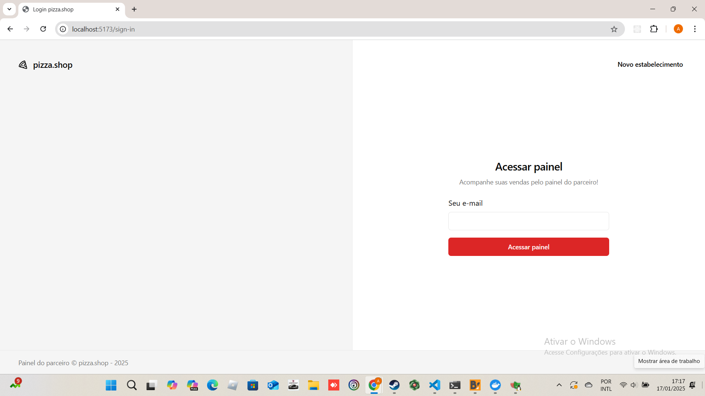
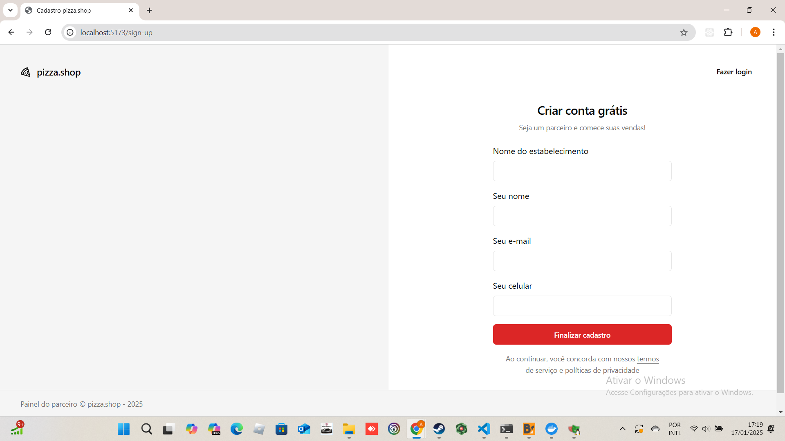
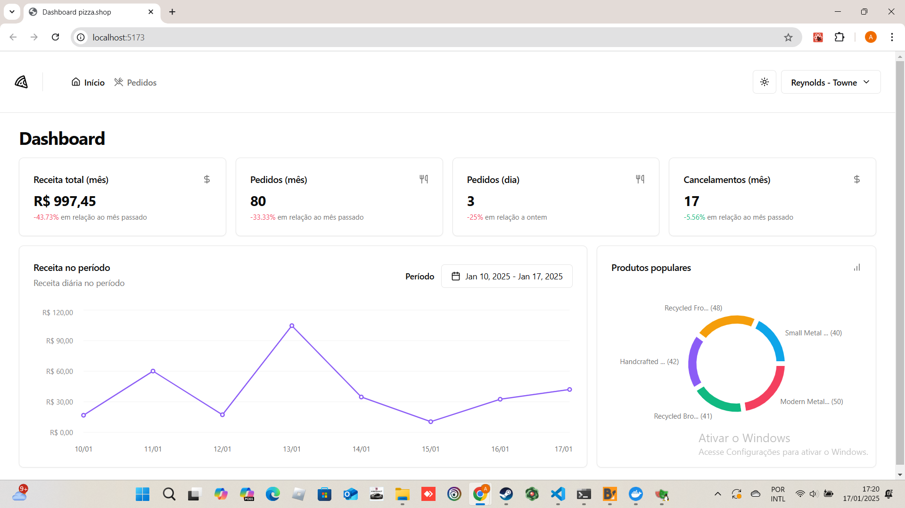
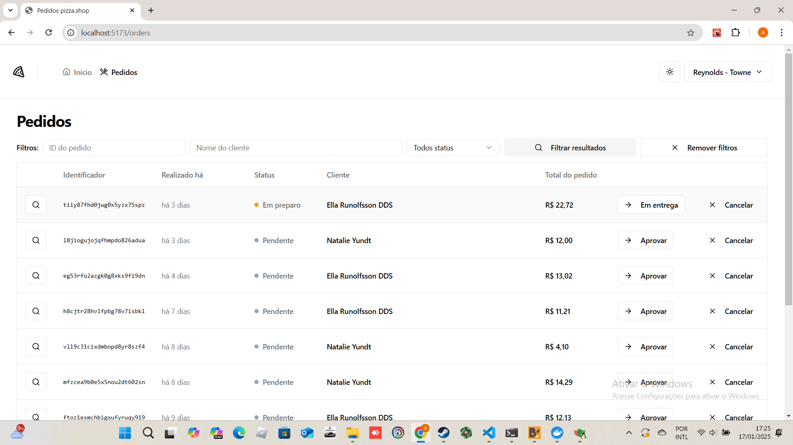
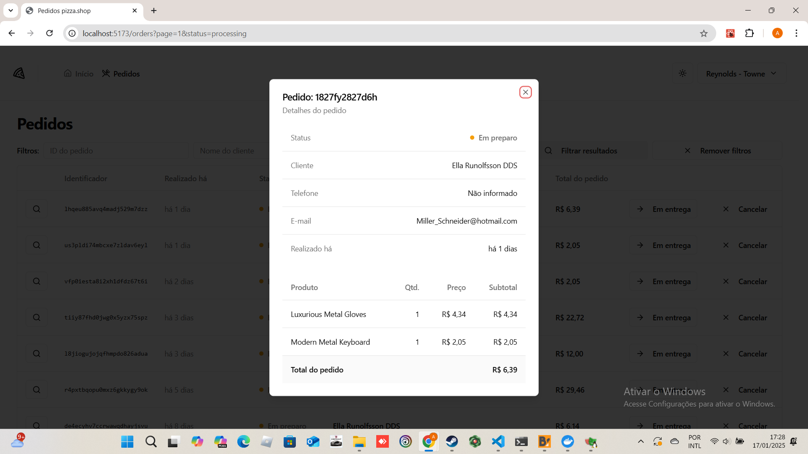
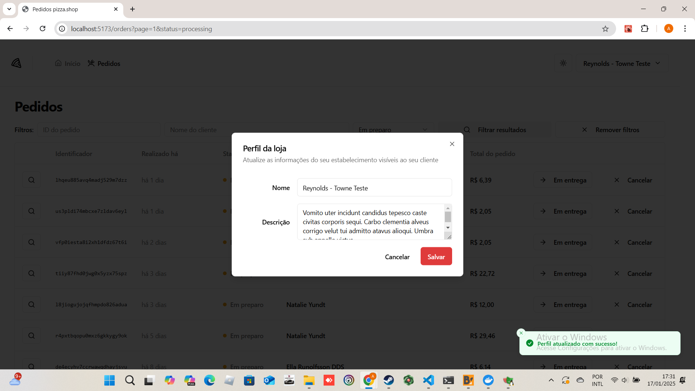
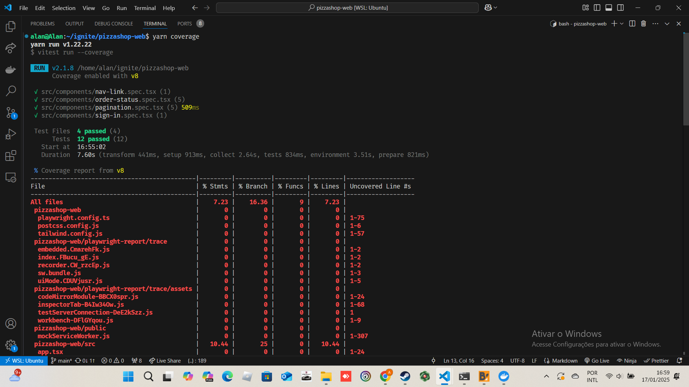
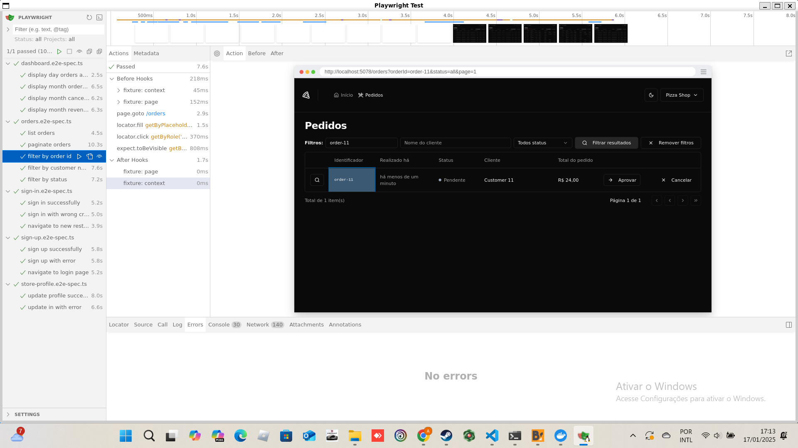

# pizzashop-web

O objetivo é  aprender <a href="https://tailwindui.com/" target="_blank">Tailwind CSS</a> e <a href="https://playwright.dev/" target="_blank">Playwright</a>.

|Login|Create account| Home| Orders| Order Details | Profile |
|-------|-------|-------|------|------|------|
|||||||

## Coverage

`yarn coverage`

|Coverage |
|-------|
||

## Playwright 

`yarn dev:test`

`yarn playwright test --ui`

|Playwright|
|-------|
||


## ✔️ Técnicas e tecnologias utilizadas

Lista das bibliotecas utilizadas no desenvolvimento:

- `@hookform/resolvers`
- `@radix-ui/react-dialog`
- `@radix-ui/react-dropdown-menu`
- `@radix-ui/react-label`
- `@radix-ui/react-popover`
- `@radix-ui/react-select`
- `@radix-ui/react-separator`
- `@radix-ui/react-slot`
- `@tanstack/react-query`
- `@testing-library/dom`
- `@types/jest`
- `axios`
- `class-variance-authority`
- `clsx`
- `date-fns`
- `localforage`
- `lucide-react`
- `match-sorter`
- `react`
- `react-day-picker`
- `react-dom`
- `react-helmet-async`
- `react-hook-form`
- `react-is`
- `react-router-dom`
- `recharts`
- `sonner`
- `sort-by`
- `tailwind-merge`
- `tailwindcss-animate`
- `zod`


## 🛠️ Abrir e rodar o projeto

### Back-end
É necessário  rodar o back-end <a href="https://github.com/AlanOlimpio/pizzashop-api" target="_blank">pizzashop-api</a> e não foi eu que criei a api de back-end, eu apenas fiz o fork e alterei o email de login para `alancleyton.olimpio@gmail.com`. É necessário ter docker instalado para rodar a api, ela faz o log o link mágico no terminal para o login.

Exemplo: `http://localhost:3333/auth-links/authenticate?code=djel91sebcgnva5g2j75avfn&redirect=http%3A%2F%2Flocalhost%3A5173`

```sh
bun i
docker compose up -d
bun migrate
bun seed
bun dev
```

### Front-end
Dentro da pasta do projeto execute npm i ou yarn para instalar as dependências, e para  rodar a aplicação é necessário abrir o terminal na pasta do projeto e digitar os comandos npm run dev  ou yarn dev.

```sh
yarn
yarn dev
```